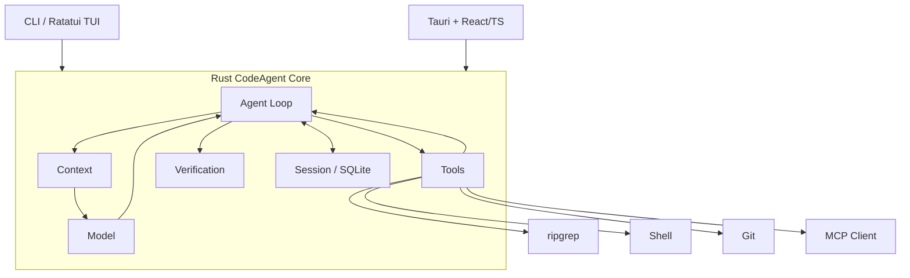

# 极简但架构先进的 CodeAgent 设计方案

## 执行摘要

建议采用 **Rust Core + Rust CLI/TUI + Tauri/React GUI** 的模块化单体：一个 Agent Loop、少量稳定抽象、SQLite 持久化、`ripgrep + shell + git` 解决多数代码操作，MCP 作为外部扩展边界。核心目标不是“功能最多”，而是用 **≤15K LOC Core** 获得可靠、可恢复、可验证的软件工程闭环。该方向与 Codex 的“共享 Harness + 多客户端”架构一致，但刻意避免过早引入 Daemon、多 Agent、VectorDB 与分布式系统。citeturn8view0turn8view1

## 极简需求

| 需求 | 优先级 | 验收标准 | 最小实现 |
|---|---|---|---|
| Agent Loop | P0 | 可连续完成 model→tool→model→final | 单 `run()` 循环 |
| 多模型 | P0 | ≥2 Provider 可切换 | 一个 `Model` trait |
| 代码工具 | P0 | 可读、改、搜、执行、看 diff | read/write、`rg`、shell、git |
| Context | P0 | 长任务不中断，token 可控 | messages + tool results + compact |
| Session | P0 | 重启后可 resume | SQLite + append-only events |
| Verification | P0 | 完成前自动执行测试 | `Vec<Command>` |
| 权限 | P0 | 默认限制工作区；危险操作需批准 | Policy + Approval |
| CLI/TUI/GUI | P1 | 三端共享完全相同 Core | Event stream + thin UI |
| MCP | P1 | 可接第三方工具且 Core 无插件框架 | MCP Client |

Codex 官方将 agent loop 定义为“模型输出工具调用→执行→结果回填→继续推理”，同时指出 context 管理是 Harness 的核心职责；安全上则采用 sandbox 与 approval 两层控制。citeturn8view0turn2view2 MCP 最新稳定规范为 `2026-07-28`，核心已转为 stateless，因此适合作为**外部能力协议**，而非内部架构。citeturn0search5turn0search6

## 极简架构原则

| 原则 | 原因 |
|---|---|
| Modular Monolith | 一个进程解决问题，减少 RPC/部署成本 |
| Core Headless | CLI/TUI/GUI 只负责交互 |
| One Agent Loop | 禁止 Planner/Coder 各自复制 Runtime |
| Abstraction on Evidence | 至少两个真实实现再抽象 |
| Deterministic First | 能用代码解决就不调用 LLM |
| Tools Few but Powerful | 5 个工具优于 50 个细工具 |
| State ≠ Context | SQLite 是事实源，Prompt 只是工作记忆 |
| Append-only Events | 易恢复、调试、审计 |
| Verification before Done | 模型不能自行宣布成功 |
| Secure by Default | workspace-only、网络/危险操作显式批准 |
| Benchmark-driven Growth | 没有指标收益就不增加架构 |

这也呼应 Codex App Server 的实践：核心 Harness 与 UI 分离，客户端消费稳定事件，而不是重新实现 Agent。citeturn8view1turn2view3

## 技术架构



Rust/Tokio 适合同时管理模型流、子进程和事件；Tauri 原生采用 Rust 后端 + WebView/JS 前端消息通信。citeturn4search0turn8view3 `ripgrep` 已支持跨 Windows/macOS/Linux、递归搜索及 `.gitignore`，因此 V1 无需自研索引器。citeturn8view5 SQLite 的单文件模型则非常适合本地 Session。citeturn9search0turn9search1

| 模块 | 职责 | LOC 预算 |
|---|---|---:|
| Agent Loop | 调模型、执行工具、停止/取消 | 800 |
| Model | Provider、stream、capability | 1,500 |
| Tool | 内置工具、权限、MCP | 2,500 |
| Context | prompt、裁剪、compact | 1,500 |
| Session/Storage | event/session/resume | 1,500 |
| Verification | build/test/lint 命令 | 500 |
| **Core 总计** | 含公共代码 | **≤12–15K** |

核心接口保持极少：

```rust
trait Model {
    async fn complete(&self, req: Request) -> Result<Response>;
}

trait Tool {
    fn name(&self) -> &str;
    async fn run(&self, input: Value) -> Result<ToolResult>;
}

async fn run(session: &mut Session) -> Result<()> {
    loop {
        match model.complete(context.build(session)?).await? {
            Response::Tool(c) => session.push(tools.run(c).await?),
            Response::Final(x) => {
                verify(&session.verify).await?;
                return session.complete(x);
            }
        }
    }
}
```

GUI 只消费协议：

```ts
type RunEvent =
  | { type: "turnStarted";   session: string }
  | { type: "itemStarted";   session: string; item: Item }
  | { type: "itemCompleted"; session: string; item: Item }
  | { type: "turnComplete";  session: string }
  | { type: "stopped";       session: string }
  | { type: "error";         session: string; message: string };
```

不要让 React 知道 `Model/Context/Tool`。OpenAI 的 App Server 同样把内部事件转换为少量稳定、UI-ready 通知。citeturn8view1

### 这次扩展改了什么，以及为什么

上面原本是四个变体（`message` / `tool{name,state}` / `approval` / `completed`）。**这一版把
它扩成了六个信封变体加七种 `Item`**，改动来自阅读 Codex 的
`codex-rs/app-server-protocol/src/protocol/v2/item.rs` 之后，不是凭空加的：

| 原来 | 现在 | 理由 |
|---|---|---|
| `message` | 用户消息 + `AgentMessage` | 两者在 UI 上的渲染完全不同 |
| `tool{name,state}` | 七种 `Item` | 工具粒度不够：`Reasoning` / `AgentMessage` 根本不是工具 |
| `completed` | `turnComplete` / `stopped` / `error` | 完成、被停止、出错是三件不同的事 |
| `approval` | **保留，本切片不实现** | 批准流属于 Agent Loop |

`Item` 的形状（`type` tag + camelCase、每种类型自己的载荷、稳定 id、耗时为
`durationMs` **数字**而不是渲染好的 `"1m 12s"` 字符串）同样取自 Codex：

```rust
pub enum Item {
    Reasoning        { id, at, summary, duration_ms },        // 只有 summary，没有 content
    Search           { id, at, query, detail, duration_ms },
    FileRead         { id, at, path, detail, duration_ms },
    CommandExecution { id, at, command, cwd, output, exit_code, duration_ms },
    ModelCall        { id, at, model, input_tokens, output_tokens },
    FileChange       { id, at, changes },
    AgentMessage     { id, at, text, checks },
}
```

**最重要的一条：`Item` 里没有 `status` 字段。**状态由信封表达——只有
`itemStarted` 而没有对应的 `itemCompleted`，那一步就是中断的。于是：

1. 前端的 reducer 统一成一句 `upsert(id, item)`，不用按种类分支处理状态；
2. 「进程被杀之后重启，停在哪一步」是**折叠日志算出来的**，不是读一个可能已经
   过期的字段读出来的。这正是「不假装完成」在协议层的落点。

**代价说清楚**：这是本文档原有设计的一次扩展，不是原设计。改动处已写明理由，
代码与文档同步。

## 本切片已落地的存储模型

`kodo-core` 仍然**零依赖**（`[dependencies]` 为空），因此下面两个文件的行协议
都是手写的。位置：`~/Library/Application Support/Kodo/`。

### `projects.log` — 手动登记的项目

```text
add     <path>
rename  <path>  <display>
remove  <path>
order   <path>,<path>,...
```

两条设计决定：

- **项目靠手动登记，不扫描目录。**上一版按 marker 文件扫描工作区根目录，实测在一台
  开发机上找出 103 个项目——列表不是信息，是噪音。现在「添加已有文件夹」只登记，
  「新建项目」才真的 `create_dir`。
- **排序写「整份顺序」，不写「把第 N 项移到第 M 位」。**`order=a,b,c` 是幂等的，
  最后一行就是真答案；而移动指令需要重放一串移动才能算出当前顺序，中间任何一行损坏
  都会让后续全部错位。少一类重放 bug。

`create` 是唯一会写用户磁盘的路径，因此有三条硬约束（都有测试）：只 `create_dir`
不 `create_dir_all`；名字必须恰好是一个 `Component::Normal`（这一条同时挡掉绝对路径、
`..`、`.`、空串和 `a/b`）；不做 `exists()` 预检，直接让 `create_dir` 返回
`AlreadyExists`，顺带覆盖 APFS 大小写不敏感的冲突。

### `sessions/<id>.log` — 每个会话一个文件

```text
open           <id> <project> <title> <at>
ask            <id> <at> <text>
item.started   <id> <at> <item>
item.completed <id> <at> <item>
turn.complete  <id> <at>
```

侧栏列表 = 列目录 + 读每个文件首行，**不另设索引文件**——没有索引就不会漂移。追加只碰
自己那个文件，一个会话损坏不影响其他会话。

转义规则：写入前 `\` → `\\`、tab/newline/CR 各自转义；读取时**先切分、再反转义**，且
反转义必须左到右单遍完成。顺序反了会出真 bug：反转义可能合成出一个真分隔符，先反转义
再切分就会把值切碎。

并发：`O_APPEND` 保证单次 `write` 不撕裂，本切片**不做跨进程加锁**——多开是罕见情形，
后果是日志多一行而不是数据损坏。

## MVP 里程碑

| 阶段 | 周 | 关键交付物 | 验收指标 |
|---|---:|---|---|
| Loop | 1–2 | Model、shell/read/write/search/git、CLI | 20 个小任务成功率 ≥70%；Core ≤6K LOC |
| Reliable | 3–4 | SQLite、resume、approval、verification | Resume 100%；CI ≥95%；First-pass ≥60% |
| Product | 5–6 | Ratatui、Tauri GUI、stream events、MCP | 三端同任务结果一致；Core ≤12K LOC |
| Benchmark | 7–8 | 100 个真实任务、context compact、性能治理 | Task Success ≥75%；回归率 <5%；Core ≤15K LOC |

指标应围绕真实任务闭环，而非“生成代码看起来正确”。OpenAI 2026 年的 Agent 实践也强调通过 traces/evals 形成 Harness 改进循环。citeturn3search2

## 部署、演进与技术边界

V1 使用**单进程 + 单二进制 `codeagent` + 本地 SQLite**；CLI 用 `clap`，TUI 用 Ratatui，GUI 用 **Tauri + React/TS**。Ratatui 当前定位就是轻量 Rust TUI；Tauri 则允许 Rust Core 与 Web UI 共存。citeturn8view6turn8view3

演进遵循“**出现可量化瓶颈才升级**”：`rg` 在大型仓库使 Context 任务失败率显著升高时才引入 Tree-sitter symbol index；只有语义召回显著优于 SQLite FTS 才上 VectorDB；只有 GUI/IDE 需要跨进程共享 Session 才增加 `codeagentd + JSON-RPC`——Codex App Server证明该模式适合多客户端，但不必在 MVP 提前承担复杂度。citeturn7search0turn8view1 多 Agent 仅在 benchmark 证明独立探索/Review 提升成功率后加入，而且优先把 `subagent` 实现成一种 Tool。分布式则只在需要远程 Sandbox、大规模并发任务时引入。

最终应长期保持：

> **Agent + Model + Tool + Context + Session + Verification**

六个核心概念；其余能力首先尝试作为配置、Tool 或外部协议存在。OpenAI 当前 Agents API 已提供 compaction、multi-agent、MCP 等更高级能力，这反而说明这些应被视为**按需增强项**，而不是你 V1 必须复制的架构层。citeturn8view2

**优先参考原文：** OpenAI《Unrolling the Codex agent loop》citeturn8view0、《Unlocking the Codex harness》citeturn8view1、Codex Security/Approvals citeturn2view2、MCP `2026-07-28` Spec citeturn0search6、Tokio citeturn4search0、Tauri Architecture citeturn8view3、ripgrep citeturn8view5、SQLite citeturn9search0。